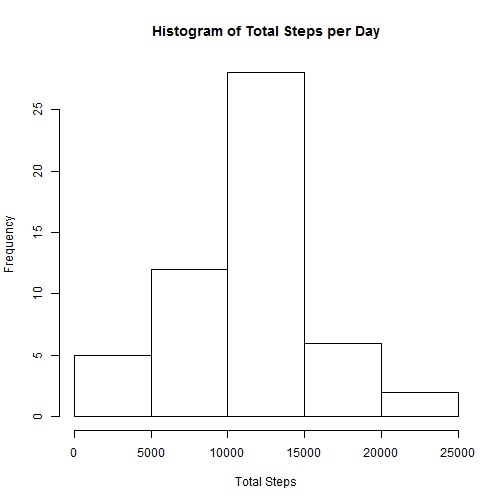
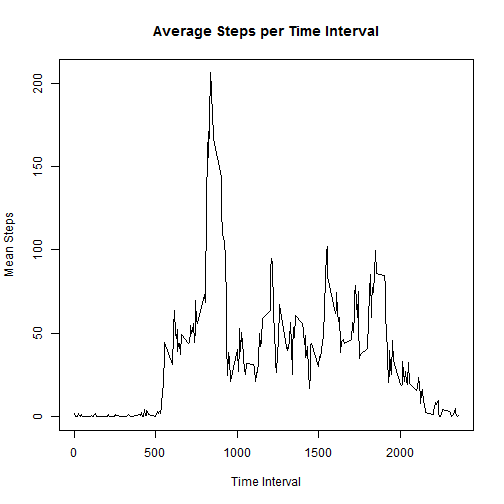
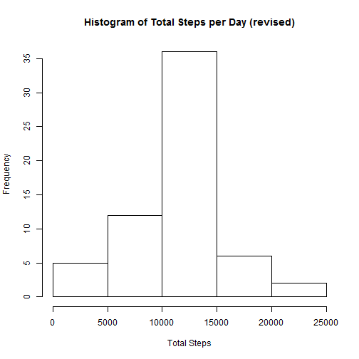
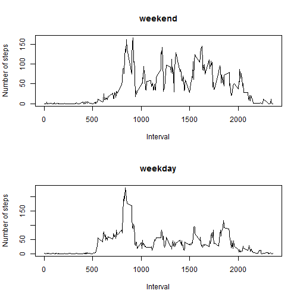

Peer Review Assignment 1:  R Markdown
========================================================

This is an R Markdown document containing the first peer review assignment of the Reproducible Research course.

The first step is to load the data set provided:


```r
activity <- read.csv("activity.csv")
```

**SECTION 1:  What is mean total number of steps per day?**

We will be plotting out a histogram of the total steps per day.


```r
#Create total sum per day data set "stepsSum"
stepsSum <- tapply(activity$steps, activity$date, sum)
hist(stepsSum, main="Histogram of Total Steps per Day", xlab="Total Steps")
```

 

Here are the mean and median steps taken per day:


```r
mean(stepsSum, na.rm=TRUE)
```

```
## [1] 10766.19
```

```r
median(stepsSum, na.rm=TRUE)
```

```
## [1] 10765
```

**SECTION 2:  What is the average daily activity pattern?**

We will now display a plot of the mean steps per interval.


```r
#Determine mean steps per interval across all days
stepsInt <- tapply(activity$steps, activity$interval, mean, na.rm=TRUE)
plot(x=names(stepsInt), y=stepsInt, type="l", main="Average Steps per Time Interval", xlab="Time Interval", ylab="Mean Steps")
```

 

This is the 5-minute interval that has the highest average:


```r
stepsInt[stepsInt==max(stepsInt)]
```

```
##      835 
## 206.1698
```

**SECTION 3:  Inputting missing values**

How many observations in the original data set are missing values?


```r
length(is.na(activity$steps))
```

```
## [1] 17568
```

We want to get rid of all of those missing values, so we will just set them to the average for that interval across all days.


```r
newSet <- activity
#Loop through each row, and if the steps are NA, then set it to the average integer for that interval across all days
for(i in 1:nrow(newSet)) {
  if (is.na(newSet[i, 1])) {
    newSet[i, 1] <- as.integer(stepsInt[names(stepsInt)==newSet[i,3]])
  }
}
```

The revised histogram would look like this.  Note that the frequency has gone up because we've increased the number of valid observations.


```r
newSum <- tapply(newSet$steps, newSet$date, sum)
hist(newSum, main="Histogram of Total Steps per Day (revised)", xlab="Total Steps")
```

 

The revised mean and median.  They vary slightly because the mean per interval was converted to an integer prior to resetting the NA values.


```r
mean(newSum)
```

```
## [1] 10749.77
```

```r
median(newSum)
```

```
## [1] 10641
```

**SECTION 4:  Are there differences in activity patterns between weekdays and weekends?**

Add an indicator to the revised data set to indicate if the day is a weekday or weekend.


```r
#Create a new column
newInd <- matrix(nrow=nrow(newSet), ncol=1)
newSet <- cbind(newSet, newInd)

#Set the values
for(i in 1:nrow(newSet)) {
  dow <- weekdays(as.Date(newSet[i,2]))
  newSet[i,4] <- ifelse(dow=="Saturday" | dow=="Sunday", yes="weekend", no="weekday")
}
```

Now we will plot the interval averages for both.  I'm using base plot, as the instructions say we can use any system.


```r
#Get the averages for both weekends and weekdays
wDays <- newSet[newSet$newInd=="weekday",]
wEnds <- newSet[newSet$newInd=="weekend",]
wDaysMean <- tapply(wDays$steps, wDays$interval, mean)
wEndsMean <- tapply(wEnds$steps, wEnds$interval, mean)

#Do a over-under display of the mean steps
par(mfrow=c(2,1))
plot(x=names(wEndsMean), y=wEndsMean, type="l", xlab="Interval", ylab="Number of steps", main="weekend")
plot(x=names(wDaysMean), y=wDaysMean, type="l", xlab="Interval", ylab="Number of steps", main="weekday")
```

 

We can see that the steps tend to cluster in the mornings during weekdays, but are much more spread on weekends.


